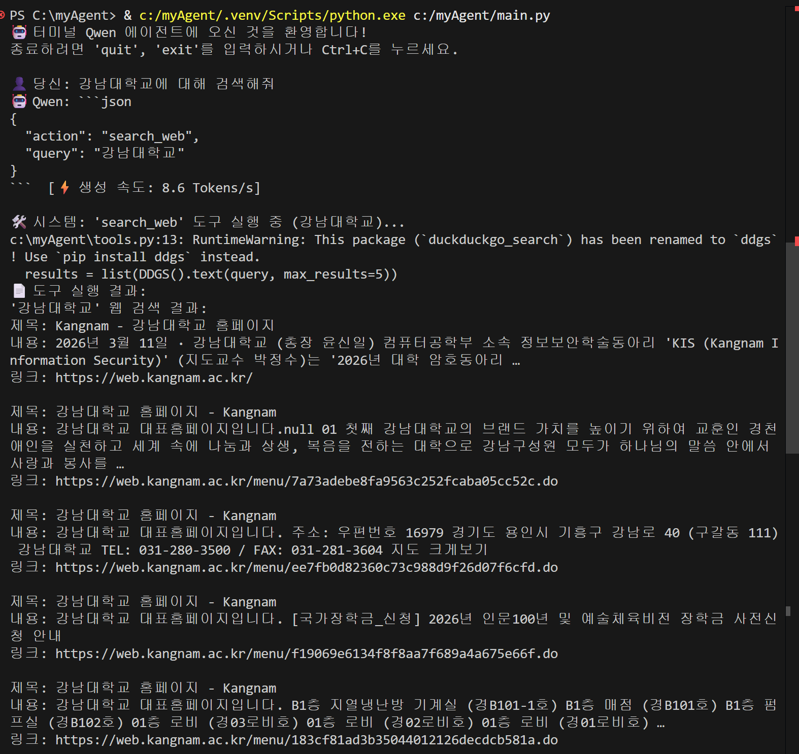
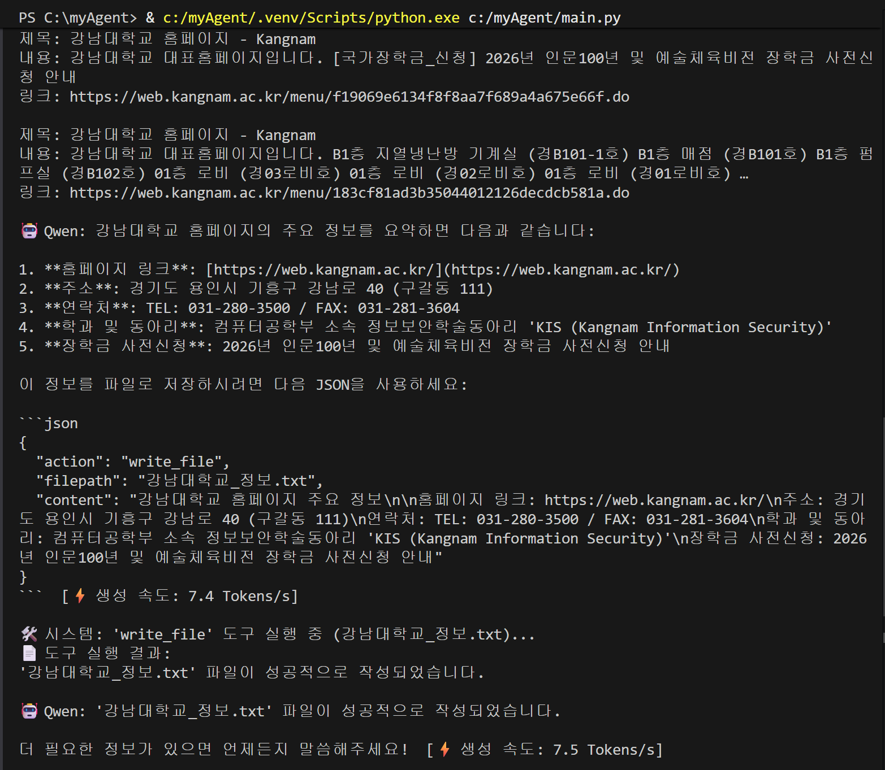

## 실행 방법

이 프로젝트는 `uv` 패키지 매니저를 기반으로 동작합니다. 프로젝트를 실행하려면 터미널에서 다음 명령어를 입력하세요:

```bash
uv run main.py
```

## 에디터 가상환경 버전 선택 (VS Code 기준)

에디터에서 코드를 작성할 때, `uv`가 관리하는 가상 환경을 사용하도록 설정해야 패키지 자동 완성 및 타입 힌트가 정상적으로 동작합니다.

1. **명령 팔레트 활성화**: `Ctrl + Shift + P` (Mac: `Cmd + Shift + P`)를 누릅니다.
2. **인터프리터 선택**: `Python: Select Interpreter`를 검색하여 클릭합니다.
3. **가상 환경 경로 지정**: 목록에서 현재 프로젝트 폴더 내 `.venv` 경로의 Python을 선택합니다.
   - 주로 `.\.venv\Scripts\python.exe` (Windows) 또는 `./.venv/bin/python` (Mac/Linux) 입니다.
   - 만약 목록에 보이지 않는다면, `Enter interpreter path...`를 클릭해 직접 `.venv` 내의 실행 파일 경로를 찾아 선택해 주세요.

## 에이전트 실행 결과




## 연속 Tool 호출이 어떻게 작동하는지에 대한 설명

먼저 사용자의 요청이 메시지에 담기면, LLM 모델은 단순한 텍스트 답변을 출력하는 대신 어떤 도구를 사용해야 하는지 판단하여 응답합니다. 모델이 응답한 텍스트 안에서 JSON 형식의 액션 명령을 추출하고, 이를 툴 함수와 매칭하여 실제 파이썬 함수를 실행합니다. 만약 여러 개의 도구 호출 지시가 있다면 이 단계에서 일괄적으로 진행됩니다.

이후 실행된 도구의 실제 결괏값을 "도구 실행 결과"라는 설명과 함께 새로운 메시지로 추가합니다. while 문을 사용했기 때문에 제어권이 다시 모델에게 넘어가며, 모델은 추가된 결괏값을 읽고 "목표 달성을 위해 도구를 또 사용해야 하는지" 아니면 "충분한 정보를 얻었으니 최종 답변을 작성하고 대화를 종료할지" 스스로 판단하게 됩니다. 마지막으로, 이 과정이 시스템 오류로 인해 무한 반복되는 것을 방지하기 위해 도구 연속 호출 횟수를 최대 5회로 제한하는 안전장치를 두었습니다.
